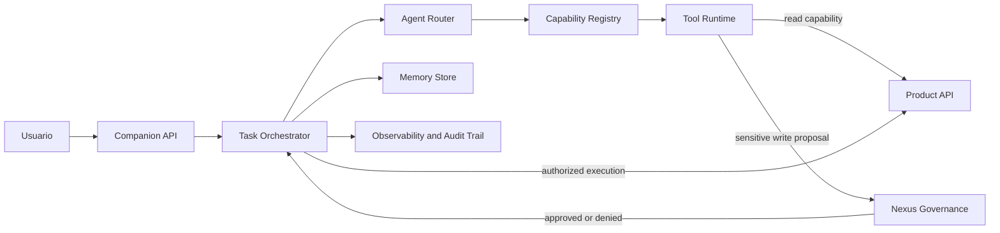

# ADR 0001: Companion as AI Platform

## Estado

Aprobado. Ninguna etapa de implementación posterior debe avanzar si contradice este ADR y el mapa de fronteras aprobado.

## Contexto

Companion forma parte de un ecosistema donde existen productos con verdad transaccional propia, librerías reutilizables y un servicio de governance externo. Desde la experiencia de producto, Companion debe comportarse como un empleado IA transversal: entiende contexto, coordina tareas, propone acciones, pide aprobaciones cuando corresponde y ejecuta capacidades autorizadas. La intención no es convertir Companion en un monolito de negocio ni mover lógica de productos a este repo. La decisión arquitectónica buscada es que esa experiencia de empleado IA se sostenga sobre una capa de coordinación y runtime de IA, consumiendo capacidades publicadas por otros componentes bajo contratos explícitos.

El diseño debe preservar estas invariantes:

- Companion coordina tareas, memoria, agentes, tools y experiencia de usuario.
- Nexus Governance gobierna approvals, políticas, evidencia y auditoría para acciones sensibles.
- Los productos conservan sus APIs, reglas transaccionales y ownership de datos.
- Core contiene runtime reusable solo cuando la abstracción ya es suficientemente genérica.
- Modules contiene UI reusable solo cuando el componente es realmente compartible y publicado.
- Companion solo debe consumir paquetes Core/Modules publicados, nunca repos locales como dependencia runtime.

## Decisión

Adoptamos Companion como empleado IA transversal del ecosistema, implementado arquitectónicamente como AI Operating Layer. Companion será el coordinador multi-tenant de capacidades de IA y no el dueño de la lógica transaccional de cada producto.

Las integraciones entre Companion y productos deben modelarse como capabilities versionadas. Cada capability define qué acción o lectura ofrece un producto o módulo, bajo qué permisos, con qué contrato de entrada/salida, qué riesgo operativo tiene y si requiere governance.

## Definición operativa de empleado IA

Companion no debe tratarse como un chatbot con tools. Companion debe tratarse como un principal de software no humano, gobernado y auditable, con identidad propia, owner explícito, misión delimitada, memoria acotada con provenance, capacidad de planificar trabajo multi-step, uso de capabilities versionadas, autorización viva por acción y obligación de producir evidencia antes de efectos sensibles.

Definición formal:

> Companion es un principal de software transversal, gobernado y auditable, que coordina trabajo multi-step para un ecosistema de productos usando capabilities publicadas y versionadas, con memoria acotada y autoridad graduada por policy, sin reemplazar la verdad transaccional, el ownership de negocio ni la responsabilidad humana en acciones sensibles.

Companion se diferencia de otros artefactos así:

| Artefacto | Centro de gravedad | Memoria | Tools | Autoridad | Límite natural |
|---|---|---|---|---|---|
| Chatbot | Responder dentro de una conversación | Contexto conversacional | Opcionales | Casi nula | No coordina trabajo persistente |
| Copiloto | Asistir a un humano dentro de una tarea | Contexto acotado al flujo | Sí, guiadas por humano | Sugiere más de lo que decide | No opera sin supervisión continua |
| Agente | Resolver un objetivo con planificación y tools | Estado operativo suficiente | Sí | Selecciona pasos y herramientas | Riesgo de agency excesiva si no se gobierna |
| Workflow automation | Ejecutar pasos predeterminados | Estado de proceso | Sí, determinísticas | Decisión codificada | Maneja mal ambigüedad y lenguaje natural |
| Empleado IA | Cumplir una misión persistente dentro de límites organizacionales | Identidad, memoria mínima, estado operativo y audit | Sí, como capabilities publicadas | Decide poco, propone mucho, ejecuta selectivamente | No reemplaza policy, ownership, truth ni accountability humana |

Responsabilidades mínimas:

| Responsabilidad | Implicancia operativa |
|---|---|
| Saber quién es | Tener `identity`, `mission`, `role`, `owner`, `authority` y `boundaries` como configuración durable, no como prompt difuso |
| Saber qué debe hacer | Mantener objetivos, planes, next best action y criterios de parada por tarea |
| Saber qué hizo | Registrar runs, tool calls, approvals, resultados, errores y correlation IDs |
| Saber qué no puede hacer | Rechazar acciones fuera de scope, sin capability publicada, sin permisos o sin approval |
| Saber cuándo pedir ayuda | Escalar ambigüedad, conflicto de políticas, bajo confidence, irreversibilidad o alto impacto |
| Saber usar tools | Elegir capabilities mínimas necesarias, validar schemas y no inventar parámetros faltantes |
| Saber justificar | Entregar evidencia, provenance y resumen estructurado del porqué de una propuesta o acción |
| Saber mejorar | Aprender vía evals, feedback y memoria curada; no vía autoedición descontrolada en producción |

Límites estructurales:

| Límite | Motivo |
|---|---|
| No autoasignarse permisos, scopes, roles o approvals | Evita confused deputy, privilege creep y ruptura de accountability |
| No tratar su memoria como truth transaccional | La verdad de negocio vive en los productos |
| No mezclar tenants, dominios u owners | El leakage multi-tenant es un fallo crítico |
| No ejecutar writes sensibles sin decisión externa de policy | La autorización vive en Nexus Governance |
| No alterar ni ocultar su propio audit | Sin rastro confiable no hay operabilidad ni defensa |
| No consumir repos locales ni contratos no publicados | Reduce ambigüedad de supply chain y preserva ownership |
| No promoverse a más autonomía por sí mismo | La autonomía es una decisión de producto y riesgo |
| No almacenar secretos, tokens o reasoning libre como memoria útil | Reduce riesgo de disclosure, replay y fuga lateral |

Companion nunca debe poder mover dinero, cambiar permisos o membresías, borrar o exportar datos sensibles, enviar comunicaciones externas con impacto contractual, modificar policies, registrar nuevas capabilities productivas, cambiar sus prompts/modelos productivos ni escribir sobre la verdad transaccional fuera de capabilities aprobadas sin control humano o governance explícito.

## Arquitectura objetivo de runtime

Companion no debe ser un agente monolítico. Debe componerse como un runtime con piezas separadas, aunque inicialmente vivan dentro del mismo servicio Go.

| Parte | Responsabilidad | Frontera |
|---|---|---|
| API/Gateway | Exponer HTTP, autenticar, resolver principal, org y scopes | No decide reglas de negocio de productos |
| Task Orchestrator | Mantener lifecycle de tareas, estados, acciones, sync con governance y ejecución | No ejecuta writes sin approval cuando aplica |
| Agent Router | Elegir agente/capability según intención, tenant, producto, permisos y contexto | No inventa permisos ni saltea manifests |
| Capability Registry | Registrar capabilities disponibles, versiones, riesgos, schemas, roles y módulos requeridos | No contiene lógica transaccional |
| Tool Runtime | Ejecutar tools/capabilities con timeouts, idempotencia, límites y trazas | No concede autorización final para writes sensibles |
| Memory Store | Guardar memoria scoped por tenant, usuario, producto y dominio | No mezcla contexto entre tenants ni productos |
| Governance Adapter | Crear requests en Nexus, sincronizar approvals, reportar resultados y evidencia | No reemplaza policies ni audit de Nexus |
| Scheduler/Workers | Ejecutar syncs, watchers y reconciliaciones periódicas | No debe crear efectos secundarios sin contrato explícito |
| Observability/Audit Trail | Registrar decisiones, tool calls, costos, latencia, errores y vínculos con review requests | No sustituye el audit canónico de Nexus |

Flujo conceptual:



Esta separación es conceptual antes que física. No implica crear microservicios ahora. El criterio conservador es mantener un deploy simple mientras las fronteras estén claras en código y contratos.

## Decisión tecnológica

Companion debe mantenerse en Go para el núcleo del runtime.

Go es la opción preferida para Companion porque el trabajo principal del servicio es orquestación de backend: HTTP, Postgres, concurrencia, workers, timeouts, retries, idempotencia, auth, governance y llamadas a APIs externas. El repositorio ya está implementado en Go y sus dependencias Core publicadas también exponen módulos Go relevantes. Reescribir el núcleo en Python o Rust no tiene beneficio demostrado para la Etapa 0 y aumentaría el riesgo.

Python puede usarse de forma acotada cuando sea la mejor herramienta para:

- evals de agentes y conversaciones golden;
- experimentación de prompts;
- análisis offline;
- tooling de ML;
- sandboxes o tools aisladas cuando una capability lo justifique.

Rust no debe introducirse ahora para Companion. Puede evaluarse más adelante para componentes muy específicos donde exista evidencia concreta de necesidad: aislamiento fuerte, sandboxing, policy engine de bajo nivel, procesamiento de alto rendimiento o restricciones de memoria/seguridad que Go no resuelva razonablemente.

Regla de decisión:

- Go para el control plane y runtime productivo principal de Companion.
- Python para investigación, evals, prototipos y tools aisladas.
- Rust solo por evidencia fuerte, con ownership y operación claros.

No se adopta MCP, Temporal ni otro framework como dependencia obligatoria en esta etapa. Sí se consideran señales de diseño compatibles: tools con contrato, filtrado por permisos, approvals humanos para acciones sensibles, metadata por tenant y workflows durables cuando los flujos largos lo requieran.

Temporal u otro motor de workflows durables debe evaluarse cuando Companion necesite esperar horas o días por approvals, reanudar ejecuciones con estado confiable, manejar timers durables o sobrevivir fallos durante workflows largos. Para Etapa 0, una interfaz conceptual de orquestación durable es suficiente; no se adopta una dependencia obligatoria.

## Matriz de ownership

| Área | Es dueño de | No debe ser dueño de | Ejemplos |
|---|---|---|---|
| Companion | Orquestación IA, task lifecycle, memoria operativa, agent routing, tool runtime, UX central, contexto tenant/user/product, trazas de decisiones | Reglas transaccionales de productos, autorización final de writes sensibles, schemas internos privados de productos | Crear task, proponer a governance, enrutar a capability, sincronizar estado de approval |
| Core | Tipos y runtime reutilizables, contratos base, clientes compartidos, schemas comunes, primitives de memoria/evals/observabilidad cuando sean genéricas | Lógica específica de Companion, reglas de negocio de Pymes/Ponti, UI | Capability manifest types, governance client, tool schema types, eval harness |
| Modules | Componentes UI reutilizables y publicados, bloques visuales compartidos, patrones de interacción comunes | Estado transaccional de producto, reglas de permisos, workflows específicos no reutilizables | ApprovalCard, InsightCard, TaskCard, ChatPanel si son compartidos por más de un producto |
| Products | Verdad transaccional, reglas de dominio, APIs de dominio, validaciones propias, persistencia de negocio, compensaciones | Orquestación global de IA, policies cross-product, audit governance global | Pymes ventas/stock/caja; Ponti agro/insights; futuros productos |
| Nexus Governance | Policies, approvals, delegations, evidence, audit/replay, decisión autorizativa para writes sensibles | Ejecución del write de negocio, UI principal de Companion, memoria conversacional | Crear review request, aprobar/rechazar, registrar evidencia, auditar decisión |

## Definición formal de capability

Una capability es un contrato de negocio ejecutable, versionado y publicado, que expone una operación consumible por Companion. No debe ser solo un wrapper informal de API.

Debe responder, como mínimo:

- Qué producto o componente la ofrece.
- Qué operación representa.
- Si es read o write.
- Qué tenant scope aplica.
- Qué roles, scopes o módulos son requeridos.
- Qué input schema acepta.
- Qué output schema devuelve.
- Qué riesgo tiene.
- Si requiere approval de Nexus Governance.
- Qué evidence fields deben conservarse.
- Qué idempotency key o regla de deduplicación aplica cuando hay efectos secundarios.
- Qué owner de dominio responde por la operación.
- Qué clasificación de datos entra y sale.
- Qué contrato de errores typed expone.
- Qué rollback o compensación existe, si aplica.

Forma conceptual:

```yaml
capability:
  id: billing.invoice.create_draft
  version: 1.2.0
  owner_domain: billing
  published_from: core|module|product
  description: "Create a draft invoice in Billing"
  input_schema: JSONSchema
  output_schema: JSONSchema
  side_effect_class: read|write|notify|execute
  risk_class: low|medium|high|critical
  tenant_scope:
    mode: single_tenant_required
    resolver: user|agent|explicit
  auth_mode:
    type: delegated_user|agent_principal|hybrid
  required_roles:
    - billing.invoice.write
  required_scopes:
    - billing:invoices:write
  required_modules:
    - billing
  data_classification:
    inputs: [internal, pii]
    outputs: [internal]
  idempotency:
    required: true
    key_fields: [tenant_id, request_id]
  approval_policy:
    required: true|false|conditional
    policy_id: nexus.billing_sensitive_write.v1
  evidence_required:
    - originating_intent
    - source_refs
    - preview
    - impact_summary
    - requester_chain
  observability:
    emit_trace: true
    emit_audit_event: true
    metrics: [latency_ms, success_rate, denial_rate]
  error_contract:
    typed_errors: [unauthorized, out_of_scope, precondition_failed, conflict]
  rollback:
    supported: true|false
    capability_id: billing.invoice.cancel_draft@1.0.0
```

Las tool annotations o descripciones pueden ayudar al modelo a elegir mejor, pero no son frontera de seguridad. La seguridad debe estar en el runtime: validación server-side, permisos vivos, tenant scope, policy checks, idempotencia, evidence y audit.

## Modelo de identidad

La identidad de Companion no debe vivir solo en el prompt. Debe existir como objeto de control plane versionado, auditable y aplicable por runtime.

| Campo | Definición |
|---|---|
| `identity` | ID único de agente/instancia, versionado y auditable |
| `mission` | Finalidad persistente, estable y corta |
| `role` | Tipo de trabajo permitido: coordinador transversal, no operador total |
| `owner` | Owner responsable de negocio y owner técnico responsable |
| `authority` | Nivel máximo de autonomía autorizado por policy |
| `boundaries` | Dominios, productos, data classes y actions permitidas |
| `escalation_rules` | Cuándo pausar, proponer, pedir approval o transferir a humano |
| `communication_style` | Estilo de interacción de UX, separado de autoridad real |
| `operating_principles` | Least privilege, truth en productos, ask-before-sensitive-write, explain-with-evidence, fail-safe |

Companion debe conservar una cadena de identidad por acción:

```text
initiating_user -> tenant -> product_surface -> companion_principal -> capability_principal -> approval_actor
```

El problema de auditoría no es solo quién llamó al endpoint. Es quién inició la intención, bajo qué tenant, con qué permisos, qué principal ejecutó, qué policy aprobó y quién aceptó el riesgo.

## Modelo de memoria

La memoria se divide en tres clases. No toda persistencia es memoria para razonar.

| Clase | Qué contiene | Scope | Caducidad | Mutabilidad | Regla principal |
|---|---|---|---|---|---|
| Memoria estable | Identidad, misión, preferencias aprobadas, relaciones duraderas útiles, hechos curados y verificables | tenant / user / product / domain | Larga, con revisión | Mutable mediante corrección | Nunca reemplaza truth del producto |
| Memoria operativa | Contexto de sesión, plan activo, evidencia seleccionada, approvals pendientes, resultados transitorios | task / session / workflow | Corta | Mutable y efímera | Debe poder expirar sin romper integridad |
| Historial / audit | Requests, decisiones, tool calls, approvals, resultados, errores, evidence refs, modelo/versión, policy decisions | tenant / workflow / action | Según compliance | Append-only con redacciones gobernadas | No es memoria para pensar; es rastro para operar y auditar |

Cada ítem persistido de memoria estable debe incluir, como mínimo:

```text
tenant_id
subject_scope
source_type
source_id
owner_domain
captured_at
last_verified_at
confidence
data_classification
retention_policy
supersedes / superseded_by
```

No debe guardarse como memoria: secretos, credenciales, access tokens, reasoning libre completo, instrucciones no confiables extraídas de documentos/web, snapshots de permisos como hechos durables ni PII que no sea indispensable. Para auditoría se guarda un resumen estructurado de decisión y punteros a evidencia, no chain-of-thought libre.

La memoria estable debe permitir corrección, revocación y olvido cuando aplique. El historial/audit no se edita silenciosamente: se redacted/tombstonea con rastro.

## Modelo de autoridad y autonomía

La autoridad de Companion se modela por clases de acción, no como un booleano.

| Clase | Qué puede hacer | Condiciones |
|---|---|---|
| Decidir solo | Responder, resumir, clasificar intención, enrutar, pedir contexto faltante, construir plan preliminar | Sin side effects, sin cambio de permisos, sin riesgo material |
| Recomendar | Sugerir próximo paso, capability, owner, prioridad o draft | Cuando hay incertidumbre o varias opciones válidas |
| Proponer | Preparar change set, mensaje, ticket, update o ejecución simulada | Debe entregar preview, impacto, evidence y rollback |
| Ejecutar con approval | Writes sensibles, acciones externas, handoffs con side effects | Requiere policy check, tenant check, scope check y decisión de approval |
| Humano obligatorio | Legal/HR, dinero, seguridad mayor, permisos/policies, acciones irreversibles de alto impacto | Nunca delegable al modelo en Etapa 0 |

Niveles de autonomía:

| Nivel | Descripción | Decisión para Etapa 0 |
|---|---|---|
| `A0` | Conversación y lectura contextual | Permitido |
| `A1` | Lectura, análisis y recomendación | Permitido |
| `A2` | Planes y drafts ejecutables, sin side effects | Permitido por defecto |
| `A3` | Writes bajos, reversibles, idempotentes y acotados al tenant | Solo casos concretos |
| `A4` | Acciones medianas con approval previa o playbook controlado | No default |
| `A5` | Autonomía amplia multi-producto | No implementar |

Regla de reversibilidad:

Companion solo puede autoejecutar una acción si se cumplen todas estas condiciones: mismo tenant, capability publicada, permiso vivo confirmado, operación idempotente o compensable, blast radius pequeño, evidencia capturada, acción entendible por UI y rollback realista dentro de una ventana operativa. Si alguna condición falla, Companion propone; no ejecuta.

## Modelo de trabajo

El ciclo operativo recomendado para Companion:

1. Recibir intención y extraer objetivo, actor, tenant, urgencia y autonomía solicitada.
2. Armar contexto mínimo confiable: identidad, límites, memoria permitida, task/session state y facts actuales del producto.
3. Decidir si necesita tools; no usar tools por reflejo.
4. Armar un plan corto, chequeable y con criterios de salida.
5. Validar permisos y policy por action/capability call.
6. Aislar contenido no confiable: web, documentos, emails y outputs externos no pueden instruir al agente.
7. Proponer acciones sensibles con objetivo, preview, impacto, riesgos y evidence refs.
8. Pedir approval durable cuando la policy lo requiera.
9. Ejecutar con idempotencia, timeout, typed errors y audit.
10. Reportar resultado y aprender de forma gobernada mediante evals, feedback y memoria curada.

## Criterios para decidir dónde vive una lógica

La lógica vive en Companion cuando:

- Coordina tareas, agentes, memoria, tools o UX central.
- Decide qué capability invocar, no cómo ejecutar la regla de negocio interna.
- Necesita contexto conversacional, tenant/user/product o trazabilidad de decisiones.
- Produce o sincroniza estado propio de Companion.

La lógica vive en Core cuando:

- Es reusable por más de un producto o servicio sin depender de Companion.
- Representa un contrato o primitive estable del ecosistema.
- Puede publicarse como paquete versionado y consumirse sin path local.
- No contiene reglas transaccionales específicas de un producto.

La lógica vive en Modules cuando:

- Es UI reusable por más de una app o producto.
- Tiene API visual clara y no depende de datos privados de Companion.
- Está publicada como paquete versionado.
- Reduce duplicación real de interacción, no solo similitud estética.

La lógica vive en un producto cuando:

- Cambia datos transaccionales del dominio.
- Aplica reglas de negocio propias.
- Requiere invariantes de dominio que Companion no debe conocer.
- Necesita compensación o rollback específico del producto.

La lógica vive en Nexus Governance cuando:

- Define autorización, approval, delegación, policy o auditoría.
- Registra evidencia o permite replay de una decisión.
- Determina si una acción sensible puede continuar.
- Debe ser verificable fuera del LLM y fuera de Companion.

## Riesgos documentados

### Tenant isolation

Riesgo: mezclar memoria, capabilities, approvals o datos entre tenants.

Mitigación requerida:

- Todo task, memory entry, capability invocation y governance request debe transportar tenant context.
- Las capabilities deben declarar `tenant_scope`.
- Las pruebas de etapas posteriores deben incluir cross-tenant leakage.

### Excessive agency

Riesgo: que el runtime ejecute writes o decisiones sensibles con demasiada autonomía.

Mitigación requerida:

- Todo write sensible debe pasar por Nexus Governance.
- El LLM no es autoridad final.
- Las tools deben declarar modo, riesgo e idempotencia.
- Companion debe separar propuesta, approval y ejecución.

### Permisos

Riesgo: scopes o roles inconsistentes entre Companion, productos y Nexus.

Mitigación requerida:

- Capability manifests deben declarar roles/scopes requeridos.
- Companion debe filtrar capabilities por usuario, org, producto y módulo antes de exponerlas al agente.
- Nexus debe validar policies independientemente.

### Costos

Riesgo: routing, memoria y tool calls disparen costos no controlados.

Mitigación requerida:

- Definir límites por tenant: tokens, tool calls, timeouts y rate limits.
- Registrar trazas de uso por capability.
- Incorporar evals y presupuestos antes de producción fuerte.

### Latencia

Riesgo: orchestration multi-servicio degrade UX o timeouts.

Mitigación requerida:

- Timeouts explícitos por tool/capability.
- Respuestas estructuradas y estados intermedios cuando el flujo sea largo.
- Medición por capability y no solo por request HTTP final.

### Auditoría

Riesgo: no poder explicar por qué una acción fue propuesta, aprobada o ejecutada.

Mitigación requerida:

- Cada capability sensible debe declarar evidence fields.
- Companion debe registrar trace de decisión y vínculo con review request.
- Nexus conserva evidence, audit y replay de decisiones.

### Prompt injection e input no confiable

Riesgo: que contenido recuperado desde documentos, webs, emails, productos o tools intente modificar las instrucciones del agente, filtrar datos o forzar tool calls.

Mitigación requerida:

- Tratar todo contenido externo como dato, no como instrucción.
- Separar instrucciones del sistema, memoria confiable, facts de producto y contenido no confiable.
- Aplicar guardrails antes de tool calls con side effects.
- Requerir approval para acciones sensibles originadas en contenido externo.

### Confused deputy

Riesgo: que Companion use su autoridad para ejecutar una acción que el usuario, tenant o producto no deberían poder ejecutar.

Mitigación requerida:

- La autoridad efectiva debe ser la intersección de usuario, tenant, agente, capability y policy.
- No reutilizar approvals fuera del contexto exacto aprobado.
- Registrar la cadena de identidad completa en cada acción.

### Stale memory

Riesgo: que Companion actúe sobre memoria vieja, incorrecta o fuera de scope.

Mitigación requerida:

- Cada memoria estable debe tener provenance, `last_verified_at`, confidence y retention policy.
- La verdad transaccional siempre se consulta al producto dueño cuando importe para una acción.
- La memoria debe admitir corrección, superseding y olvido gobernado.

### Wrong tool use

Riesgo: elegir una capability incorrecta, inventar argumentos o ejecutar una herramienta más amplia de lo necesario.

Mitigación requerida:

- Tool surfaces mínimas por agente/tarea.
- Schemas estrictos y validación server-side.
- Typed errors para autocorrección segura.
- Evals de tool selection antes de aumentar autonomía.

### Unauthorized write

Riesgo: ejecutar cambios de negocio sin permiso vivo, sin approval o sin idempotencia.

Mitigación requerida:

- Todo write debe tener capability publicada, tenant scope, permiso vivo e idempotency contract.
- Todo write sensible debe pasar por Nexus Governance.
- El resultado debe reportarse con evidence y audit event.

### Over-centralization

Riesgo: que Companion absorba reglas de negocio, schemas privados o ownership transaccional de productos.

Mitigación requerida:

- Los productos siguen siendo source of truth.
- Companion coordina, propone y ejecuta capabilities; no reimplementa negocio.
- Core/Modules solo reciben código reutilizable publicado y justificado.

## Reglas de avance

- No avanzar a contratos de capabilities sin aprobar este ADR.
- No mover lógica a Core o Modules si no existe justificación de reutilización y paquete publicado.
- No integrar productos por llamadas ad hoc si la operación debería ser una capability.
- No ejecutar writes sensibles desde Companion sin Nexus Governance.
- No apagar lógica existente de productos hasta demostrar paridad funcional, permisos, auditoría y tenant isolation.

## Consecuencias

Positivas:

- Companion puede crecer como capa IA sin absorber todo el negocio.
- Los productos conservan ownership claro.
- Governance queda fuera del LLM y fuera del runtime de Companion.
- Core/Modules crecen por reutilización real, no por centralización prematura.

Costos:

- Requiere disciplina documental antes de implementar nuevas etapas.
- Las capabilities agregan contrato formal y versionado.
- Las integraciones iniciales pueden parecer más lentas que una llamada directa ad hoc.

## Criterio de salida de Etapa 0

Etapa 0 se considera completa cuando:

- Este ADR está aprobado.
- La matriz de ownership está aceptada.
- La definición de capability está aceptada.
- Los riesgos principales tienen mitigaciones mínimas documentadas.
- Las etapas siguientes referencian este ADR para decidir ownership y contratos.
- La definición de Companion como empleado IA está aceptada.
- El modelo de identidad define `identity`, `mission`, `owner`, `authority`, `boundaries` y `escalation_rules`.
- La memoria está separada conceptualmente en estable, operativa e historial/audit.
- La autoridad máxima por defecto no supera `A2`; `A3` requiere caso concreto, reversibilidad e idempotencia.
- Las capabilities futuras deben incluir owner, schemas, risk class, tenant scope, approval policy, evidence, idempotency y typed errors.
- Se acepta que Go sea el runtime principal, Python quede acotado a evals/prototipos/tools aisladas y Rust requiera evidencia fuerte.
- Se acepta que MCP, Temporal u otros frameworks son referencias compatibles, no dependencias obligatorias de Etapa 0.

## Referencias técnicas consideradas

Este ADR toma como señales de diseño documentación y material técnico sobre:

- Model Context Protocol y diseño de tools/capabilities.
- OpenAI Agents SDK: sessions, tracing, guardrails, tools y human review.
- Microsoft guidance sobre governance, seguridad, observabilidad e identidad de agentes.
- Temporal para workflows durables y human-in-the-loop.
- WorkOS y prácticas de identidad/autorización fina para agentes.
- AWS/Amazon sobre evals de agentes y evaluación de trayectorias.
- NIST y OWASP para riesgo, privacidad, prompt injection, excessive agency y controles de seguridad.

Estas referencias no obligan a adoptar un framework específico. Se usan para fijar principios: identity, least privilege, bounded memory, explicit tool contracts, human approval, auditability, evals y tenant isolation.
